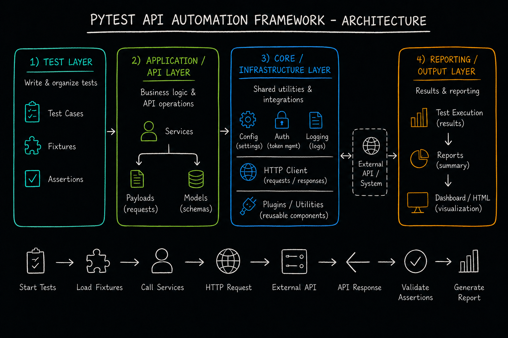

# pytest API Sample Framework

A pytest-based API test framework, currently exercised against [`gorest.in`](https://gorest.in).
No packaging or install step — `core/` and `api/` are plain packages imported straight off the
repo root, added to `sys.path` by the root [`conftest.py`](conftest.py).

Every request and every check is recorded before it can pass or fail, so a test run leaves
evidence, not just a green or red dot: what was sent, what came back, what was checked, and
whether it held.

## Contents

- [Architecture](#architecture)
- [Feature highlights](#feature-highlights)
- [Getting started](#getting-started)
- [Running tests](#running-tests)
- [Adding a new resource](#adding-a-new-resource)
- [Writing a test case](#writing-a-test-case)
- [Setting this up for a new project](#setting-this-up-for-a-new-project)
- [QA Agent — automated pipeline](#qa-agent--automated-pipeline)
- [Reports](#reports)

## Architecture

The framework is four layers, each with one job, wired in one direction only:



| # | Layer | Lives in | Responsibility |
|---|-------|----------|-----------------|
| 1 | **Test** | `tests/` | Test cases, fixtures, assertions — what you actually write |
| 2 | **Application / API** | `api/` | Services, payload builders, schemas — the API under test, in your control |
| 3 | **Core / Infrastructure** | `core/` | Config, HTTP client, auth, assertions, recording, reporting — the engine, never imported by tests |
| 4 | **Reporting / Output** | `reports/` | HTML report, run history, evidence ledgers |

**Rule of thumb:** adding a new resource (e.g. "posts") means adding files under `api/` and
`tests/`. You should never need to touch `core/`.

### Request flow — one call, traced

```
test → *_service fixture → BaseService._get/_post/... → ApiClient.request()
     → retries + bearer token injection → ApiResponse → RecorderProxy
     → worker's ledger .jsonl → report.html
```

`ApiClient` is session-scoped and has no notion of "current test" — a `RecorderProxy` forwards
each `RequestRecord` to whichever `Recorder` is bound to the test currently running, via a
`contextvars` context.

### Assertion flow

`core.assertions.assert_*()` builds an `AssertionRecord` and sends it to the active `Recorder`
**before** raising — so both passing and (per configured level) failing checks land in the
evidence trail, and a failure surfaces as a normal pytest `AssertionError`
(`VerificationError`), never a silent internal error.

### Session-end flow

`pytest_sessionfinish` closes the ledger. `pytest_terminal_summary` — controller process only,
xdist workers skip this — merges every worker's `*.jsonl`, builds a `run_model`, and writes
`report.html`, `summary.json`, and an updated `index.html` / `history.json`.

## Feature highlights

- **Config resolution** — `pytest.ini` + `environments.py` + `API_*` env-var overrides, merged
  into one frozen, validated `Settings` object at collection time. A bad config fails fast, with a
  readable error, instead of failing mid-run.
- **Pooled, retrying HTTP client** — `ApiClient` wraps a `requests.Session` with connection
  pooling, retries on transient statuses (429/502/503/504, exponential backoff), bearer-token
  injection, and a uniform `ApiResponse` wrapper. Tests never see a raw `requests.Response`.
- **Fixed bearer-token auth, per role** — no login flow. Tokens are read once from
  `<API_ENV>_<ROLE>_TOKEN` env vars (populated via a gitignored `.env`) and cached in memory.
- **Rich, typed assertions** (`core/assertions.py`) — status, field (dotted/indexed path), field
  presence, header, header presence, schema, list (length/uniqueness/sort/predicate), response
  time, plus `soft_assertions()` to collect multiple failures before raising once. **A bare
  `assert` is disallowed by convention** — it produces no evidence record and silently vanishes
  from the report, so every check goes through this module.
- **Schema / contract validation** — `SchemaRegistry` indexes plain pydantic models declared in
  `api/schemas/*.py` (a `SCHEMAS = {name: Model}` dict per file) and validates responses against
  them via `assert_schema(resp, "name")`. Models use `extra="forbid"`, so both missing and
  unexpected fields are flagged as contract drift.
- **Evidence ledger + HTML report** — every request (including every retry attempt) and every
  assertion is recorded per-test to an append-only JSONL ledger, then merged and rendered into an
  HTML report at session end, with a history page across the last runs.
- **Configurable verbosity** — `api_log_level` (`ERROR`/`WARNING`/`INFO`/`DEBUG`/`TRACE`)
  controls how much evidence is kept per record, from "only failing tests" up to "every retry
  attempt with full headers/bodies." Levels are additive — they never change *what* runs.
- **Redaction** — configured keys (`authorization, password, token` by default) are masked in
  headers/bodies, at any nesting depth, before anything touches disk. Oversized bodies are
  truncated with an explicit `[...truncated...]` marker.
- **xdist-safe** — one ledger file per worker, merged only by the controller process at session
  finish; the report is rendered exactly once, never per-worker.
- **Test data builders** — `api/payloads/*.py` build valid request bodies with sane random
  defaults (deterministic under a seed) and an `OMIT` sentinel for dropping a field on purpose in
  negative tests.
- **Cleanup fixtures** — `created_user` / `cleanup_users` in [`tests/conftest.py`](tests/conftest.py)
  delete anything a test created, pass or fail, so the target API never accumulates test data.

## Getting started

```bash
cp .env.example .env             # fill in DEV_DEFAULT_TOKEN at minimum
pip install -r requirements-test.txt
```

## Running tests

```bash
pytest                                              # full suite, pytest.ini defaults (api_env=dev)
pytest tests/users/test_users.py                    # one file
pytest tests/users/test_users.py::test_create_user  # one test
pytest -m smoke                                     # marker filter: smoke | regression | contract
API_ENV=stage pytest                                # any pytest.ini key overridable via API_<KEY>
API_LOG_LEVEL=TRACE pytest                          # full evidence, incl. every retry attempt
```

There is no lint/build/typecheck command configured in this repo.

## Adding a new resource

Adding a resource (say, `posts`) touches only `api/` and `tests/` — never `core/`. Six steps, in
order:

| Step | File to add | Notes |
|------|-------------|-------|
| 1. Endpoints | `api/constants.py` → `PostsEndpoints` | Same shape as `UsersEndpoints` |
| 2. Service | `api/posts_service.py` | Subclass `BaseService`, set `service_name`, one method per business action, always returns `ApiResponse` |
| 3. Payload builder | `api/payloads/posts_payloads.py` | `build_post(**overrides)` — deterministic under `_seed`, supports `OMIT` for negative tests |
| 4. Schema | `api/schemas/posts.py` | Pydantic models + a module-level `SCHEMAS = {"post": Post, "posts_list": list[Post]}` dict — the registry auto-indexes it |
| 5. Fixture | `tests/conftest.py` → `posts_service` fixture | Add a `cleanup_*` fixture too if creates need tearing down |
| 6. Tests | `tests/posts/test_posts.py` | The actual test cases |

```python
# api/posts_service.py
class PostsService(BaseService):
    service_name = "posts"
    def create_post(self, **body) -> ApiResponse:
        return self._post(PostsEndpoints.BASE, json=body)
```

```python
# tests/conftest.py
@pytest.fixture
def posts_service(api_client: ApiClient) -> PostsService:
    return PostsService(api_client)
```

## Writing a test case

Arrange via fixtures, act via the service, verify only via `core.assertions`:

```python
from api.payloads.users_payloads import build_user
from core.assertions import assert_status, assert_schema, assert_field

def test_create_user(users_service, cleanup_users):
    response = users_service.create_user(**build_user())
    cleanup_users.append(response.json()["id"])

    assert_status(response, 201)
    assert_schema(response, "user")
    assert_field(response, "email", response.request_body["email"])
```

Guidelines:

- **Never use a bare `assert`** — it produces no evidence record and silently disappears from the
  report. Always go through `core.assertions`.
- Use `soft_assertions()` when a test needs to check several independent things and report all
  failures at once, instead of stopping at the first.
- Mark tests with `@pytest.mark.smoke` / `regression` / `contract` (declared in `pytest.ini`) so
  `-m` filtering and the report's grouping both work.
- For negative tests, build a bad payload with the same builder plus `OMIT`, e.g.
  `build_user(email=OMIT)`.
- Use `assert_response_time(resp, ms)` for latency budgets instead of hand-rolled timing checks.
- Clean up anything you create — use or extend a `cleanup_*` fixture rather than deleting inline,
  so cleanup still runs on failure.

## Setting this up for a new project

To point this framework at a different API, or stand up a new environment against the same one,
everything lives in three places:

1. **Environments and base URLs** — `environments.py`. Add or edit a key in the `ENVIRONMENTS`
   dict:
   ```python
   ENVIRONMENTS = {
       "dev":   {"BASE_URL": "https://api.example.com"},
       "stage": {"BASE_URL": "https://stage.api.example.com"},
       "prod":  {"BASE_URL": "https://api.example.com"},
   }
   ```
   `api_env` in `pytest.ini` (or `API_ENV` at run time) selects which key is active. `BASE_URL`
   can also be overridden per run without an ini edit, via `API_BASE_URL`.

2. **Tokens, per environment and role** — `.env` (copy from `.env.example`, gitignored, never
   committed). Naming convention is `<API_ENV>_<ROLE>_TOKEN`, uppercase — `core.auth.TokenProvider`
   derives the variable name from `api_env` plus whatever role string a test passes it, so adding
   a role (`admin`, `viewer`, `service-to-service`, ...) just means adding a new env var, nothing
   in code changes. Most suites only need `<ENV>_DEFAULT_TOKEN` filled in — that's the role used
   when a test doesn't name one.

3. **Framework-wide settings** — `pytest.ini`. Every `api_*` key (log level, timeout, retries,
   report dir, redaction keys, body-truncation cap, latency budget, schema dir) is documented
   inline in the file and overridable per run via `API_<KEY UPPERCASED>` for CI, with no ini edit
   needed.

Everything else — `core/`, `api/base_service.py`, the report pipeline — is project-agnostic and
should not need changes; only `environments.py`, `.env`, and `pytest.ini` are project-specific.

## QA Agent — automated pipeline

This repo ships a QA Agent: a set of Claude Code skills under [`.claude/skills/`](.claude/skills/)
that take a plain-language test request through design, planning, scaffolding, code generation,
review, and execution — each stage handing structured output to the next, so nothing downstream
has to re-derive intent from scratch.

| Stage | Skill | Produces | Notes |
|-------|-------|----------|-------|
| 0 | `testcase-writer` | `testcase.md` | Turns a request into structured test cases; asks about every ambiguity; needs explicit field-by-field approval before writing. `test_name` is frozen here. |
| 1 | `test-plan` | `plan.md` | Resolves every fixture, service, payload, and schema a test case needs to an **exact existing identifier**. Halts (`BLOCKED`) on anything missing — never invents one. |
| 2 | `test-setup` | endpoints, service, payload builder, schema, fixture | Only runs when `test-plan` reports `BLOCKED`. Owns the same six "adding a new resource" steps above (minus the test itself). **Requires explicit approval** before writing, whether invoked by hand or by the pipeline. |
| 3 | `test-creator` | `tests/<feature>/test_*.py` | Writes the test purely by wiring together identifiers `plan.md` already resolved — no re-deriving requirements. |
| 4 | `test-review` | — (writes nothing) | Mechanical conformance pass, then a judgement pass for deviations, gaps, and missing coverage, checked against `plan.md` and `testcase.md`. |
| 5 | `execution-review` | `execution-report.md` | Runs the test via pytest and checks the resulting evidence against `plan.md` and `testcase.md`. |

All artifacts for a given test case live together, one folder per `test_name`:
`testCaseBaseDir/<feature>/<test_name>/{testcase.md, plan.md, execution-report.md}`.

**Running it:**

- End to end, from a plain request: invoke `test-pipeline` — it runs `testcase-writer` (if no
  `testcase.md` exists yet), `test-plan`, `test-setup` if anything comes back `BLOCKED` (pausing
  for its mandatory approval), `test-creator`, `test-review`, and `execution-review`, in order.
- Any single stage can also be invoked by hand — e.g. re-run `test-plan` after adding a schema by
  hand, or `execution-review` alone to re-check a test that already exists.
- The approval gates on `testcase-writer` and `test-setup` are mandatory regardless of whether a
  human or `test-pipeline` triggered the stage — the pipeline never bypasses them.

## Reports

```
reports/<env>/<timestamp>/report.html   # full per-test evidence trail for one run
reports/<env>/<timestamp>/summary.json
reports/<env>/index.html                # entry point listing every run
reports/<env>/history.json              # last 12 runs, feeding the report's trend chart
reports/<env>/ledger/*.jsonl            # per-worker evidence ledgers, merged at session end
```

After a run, open `reports/<api_env>/<timestamp>/report.html` for the full evidence trail
(requests, retries, assertions, timings), or `reports/<api_env>/index.html` for run history.
